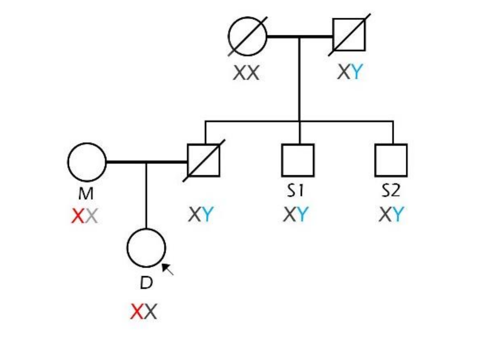

## Zadanie 3 (5b)

V tomto zadaní budete pracovať s nástrojom FamLinkX a datasetom **dna_screening_zadanie** dostupným v priečinku `inputs`. 

Dataset obsahuje údaje matky, dcéry a dvoch strýkov, ktorí sú bratmi muža, u ktorého predpokladáme, že je otcom dcéry. Je potrebné potvrdiť alebo vyvrátiť či bol muž otcom dievčaťa. Pomocou nástroja FamLinkX zostavte hypotézy s rodokmeňom členov, vykonajte analýzu, určte výsledné pravdepodobnosti hypotéz a uveďte výsledné rozhodnutie na potvrdenie/zamietnutie otcovstva.

### Úloha 1 (1b)

**Formulujte hypotézy pre riešenie úlohy:**

- **H0 (Základná hypotéza):** Dvaja testovaní muži (bratia predpokladaného otca) sú biologickými strýkami dcéry z otcovej strany. (Predpokladaný otec bol biologickým otcom dievčaťa).
- **HA (Alternatívna hypotéza):** Dvaja testovaní muži nie sú v žiadnom príbuzenskom vzťahu s dcérou. (Biologickým otcom dcéry je neznámy náhodný muž z populácie).

### Úloha 2 (4b)

Vykonajte analýzu pomocou nástroja FamLinkX. Ako referenčnú databázu použite Českú alebo Nemeckú databázu. Ako prílohu zadania odovzdajte vygenerovaný report z analýzy (Case report vo formáte .rtf). 

**Uveďte LR a pravdepodobnosť (W) pre jednotlivé hypotézy a Váš záver analýzy:**

- **LR (Likelihood Ratio):** 0
- **W (Pravdepodobnosť H0):** 0 %

**Záver:** 
Z genetickej analýzy vyšlo LR = 0, čo znamená, že hypotéza H0 je biologicky nemožná a W je 0 %. S istotou tak môžeme **zamietnuť otcovstvo**. Predpokladaný muž NIE JE biologickým otcom dcéry (prijímame alternatívnu hypotézu HA). 

Túto nezhodu môžeme pozorovať napríklad u markera DXS7423: Dcéra zdedila po matke alelu 14, preto od otca musela zdediť alelu 16. Obaja strýkovia však majú alely 14 a 15, čo znamená, že ich matka (stará mama) mala genotyp (14, 15). Keďže stará mama nenesie alelu 16, nemohla ju odovzdať svojmu synovi (predpokladanému otcovi), a teda on ju nemohol odovzdať dcére.